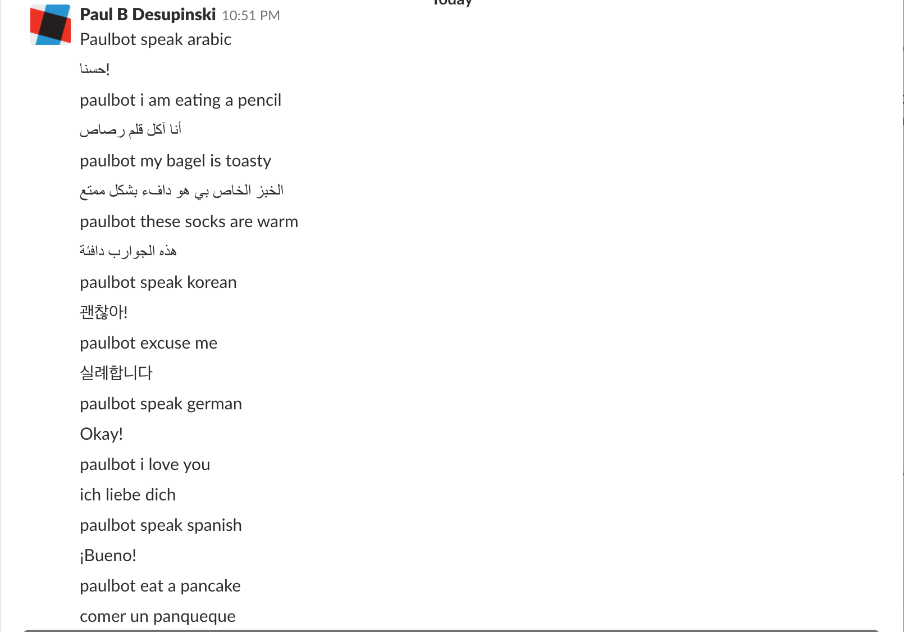

# PaulBot
Paulbot is a multilingual chatbot which automatically translates messages into the language of your choice. Here is the basic flow:
 1. You: paulbot speak [any language]
 2. Paulbot: Okay! (but translated into that language)
 3. You: paulbot [message to be translated]
 4. Paulbot: [translated message]
For example,
 1. You: paulbot speak Dutch
 2. Paulbot: Oke!
 3. You: paulbot my bagel is on fire
 4. Paulbot: mijn bagel staat in brand
 5. You: paulbot knees weak arms are heavy mom's spaghetti
 6. Paulbot: knieën zwakke armen zijn zware moeders spaghetti
You can switch Paulbot's language as many times as you want, and have it translate as many messages as you want between language changes. Additionally, *paulbot autocorrects your spelling errors*!
 1. You: paulbot i caan seee myy house from heere
 2. Paulbot: ik kan mijn huis vanaf hier zien
# Heroku url
Unfortunately, I could not debug an odd port error with heroku, so you must run Paulbot locally.
https://help.heroku.com/UMAUQ4UF/why-am-i-seeing-application-error
# Screenshot

